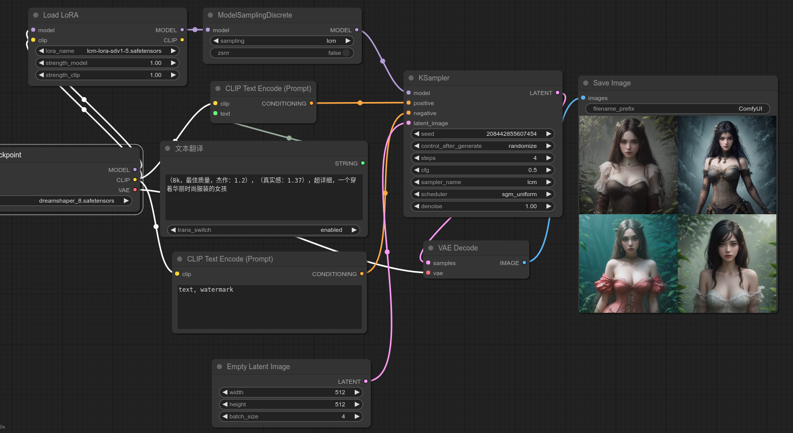

# ComfyUI-Prompt-Translator-diy
ComfyUI-Prompt-Translator-diy为中文提示词插件。自动识别中文,兼容英文。

增加了自定义的字典 .(translations.csv),使翻译后的结果更能贴合stablediffusion模型的语句习惯!

它基于翻译模型 [https://huggingface.co/Helsinki-NLP/opus-mt-zh-en]

 该翻译插件不需要联网翻译，只需要下载翻译模型就可以正常工作。  

## 环境
```
需要cuda,因为现在生图速度大幅增加,翻译速度也需要跟上来,所以直接采用cuda推理了
ubuntu 20.04
NVIDIA-SMI 525.116.03   Driver Version: 525.116.03   CUDA Version: 12.0 
Loading: ComfyUI-Manager (V1.0.1)
ComfyUI Revision: 1698 [107e78b1] | Released on '2023-11-16'
```

## 安装插件
```
cd ComfyUI/custom_nodes
git clone https://github.com/gaodianzhuo/ComfyUI-Prompt-Translator-diy.git
```

## 翻译模型位置
```
opus-mt-zh-en目录,放在ComfyUI主目录下

-ComfyUI
 --opus-mt-zh-en
```

## 使用效果


## 参考项目
https://github.com/MofaAI/ComfyUI-Prompt-Translator
https://github.com/studyzy/sd-prompt-translator